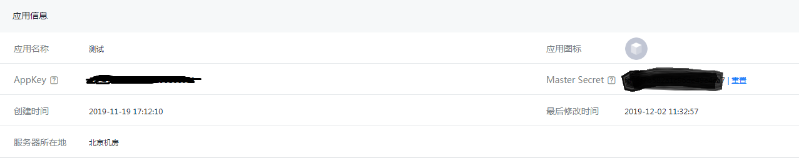
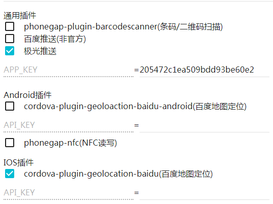

# 手机端(H5)消息推送解决方案

## 服务端

    使用Yigo的多Solution解决方案

* 下载本项目中的solution目录

* 修改用户项目中的core.properties文件启用多solution配置

    多Solution的配置方法请参考项目根目录下的文档，这里需要注意子Solution名字不能取成Push。

* 在主项目的Solution中做如下配置

    * 新增一个properties目录

    * 在上面创建的properties目录中添加push.properties文件

    * push.properties文件中添加相关推送的配置信息

        * pushType
            
            * 百度推送

                com.bokesoft.yigo.service.pushservice.impl.BaiduPush

            * 极光推送

                com.bokesoft.yigo.service.pushservice.impl.JPush

        * 百度推送

            

            * baidu.android.apiKey

            * baidu.android.secretKey

            * baidu.ios.apiKey
            
            * baidu.ios.secretKey

        * 极光推送

            

            * jpush.appKey

            * jpush.masterSecret

## 客户端

    打包网站已经集成了百度推送和极光推送的插件，可以自行到打包网站进行设置

### 极光推送

    极光推送的IOS配置中支持开发和正式两个证书，由于当前打包网站不支持开发方式打包，所以只需要上传正式的证书



* 申请极光推送的帐号

* 申请一个应用

* 在打包网站的项目的插件配置中选中极光推送，然后在APP_KEY属性上填入极光推送中的AppKey.

### 百度推送

    由于暂时没有办法申请应用，所以文档缺失

## 调用方式

### InvokeService

    提供了名为PushService的RemoteService

* PushToAll

    1. title
    2. message

    ```javascript
    InvokeService("PushService", false, false, "PushToAll", "Test", "Test")
    ```

* PushToUser

    1. 用户的Id
    2. title
    3. message
    ```javascript
    InvokeService("PushService", false, false, "PushToUser", 21, "Test", "Test")
    ```

* PushToAllOnline

    1. title
    2. message
    ```javascript
    InvokeService("PushService", false, false, "PushToAllOnline", "Test", "Test")
    ```
### 服务端

#### YIGO服务端公式

* PushToUser

    1. 用户的Id
    2. title
    3. message

* PushToAll

    1. title
    2. message

* PushToAllOnline

    1. title
    2. message

### Java直接调用

